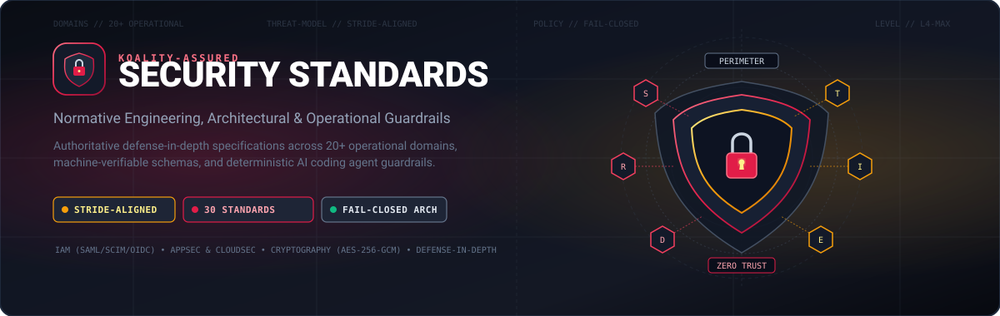

<div align="center">
  
</div>

<div align="center">
  
  <h1>Koality-Assured Security Standards</h1>
  <p><strong>Normative Engineering, Architectural, and Operational Security Standards Across 20+ Operational Domains</strong></p>

  [](https://github.com/Koality-Assured/security-standards/actions/workflows/ci.yml)
  [](LICENSE)
  [](standards/)
  []()
  [](standards/)
  []()
</div>

---

## Mission & Purpose

**Koality-Assured Security Standards** provides an authoritative, machine-verifiable, and human-verifiable catalog of normative security policies, defensive architectures, and operational requirements. 

Spanning **20+ operational security domains** and **30 normative standards**, this repository defines non-negotiable baselines designed for:
1. **Engineering Teams**: Clear, deterministic implementation requirements for cloud infrastructure, application code, cryptography, and network perimeters.
2. **Autonomous AI Coding Agents**: Machine-readable frontmatter and structured constraints that prevent privilege escalation, data leakage, insecure defaults, and prompt injection vulnerabilities.
3. **Continuous Auditing & Compliance**: Strict automated integrity checks, schema validation, and alignment with NIST SP 800-53, OWASP ASVS, CIS Benchmarks, and the STRIDE threat model.

All standards in this repository enforce a **fail-closed** architecture: systems must default to denial of access, strict validation of untrusted inputs, and explicit authorization.

---

## Defense-in-Depth Architectural Model

The standards enforce multi-tiered defense-in-depth across the entire lifecycle of software systems, services, data, and agentic workflows:

```mermaid
flowchart TD
    subgraph LayerPerimeter ["1. Perimeter & Edge Defense (Internet Facing)"]
        DDoS["DDoS Mitigation & Edge CDN"]
        WAF["Web Application Firewall (WAF)"]
        TLS["Strict TLS 1.3 Termination & HSTS"]
    end

    subgraph LayerNetwork ["2. Network & Transport Security"]
        ZTNA["Zero Trust Network Access (ZTNA)"]
        MicroSeg["VPC Micro-segmentation & Firewalls"]
        DNSSEC["Secure DNS & DNSSEC Resolution"]
    end

    subgraph LayerIdentity ["3. Identity, Access & Governance (IAM)"]
        SSO["Federated SSO & Phishing-Resistant MFA"]
        SCIM["Automated Lifecycle Management (SCIM)"]
        JIT["Just-In-Time Elevation & Break-Glass"]
    end

    subgraph LayerWorkload ["4. Workload, Application & AI Security"]
        AppSec["AppSec Guardrails & Input Sanitization"]
        AISec["AI Agent Sandboxing & Prompt Defense"]
        SupplyChain["Dependency Auditing & SBOM Verification"]
    end

    subgraph LayerData ["5. Cryptography & Data Protection"]
        CryptoCore["AES-256-GCM / Hardware Security Modules"]
        DataClass["Data Classification & Retention Policies"]
        Backup["Immutable Isolated Backups & Restore Tests"]
    end

    subgraph LayerDetection ["6. Continuous Monitoring & Detection"]
        SIEM["Centralized Immutable Audit Logging"]
        VulnScan["Automated KEV Vulnerability Patching"]
        IR["Incident Response & Fast-Containment SLA"]
    end

    LayerPerimeter --> LayerNetwork
    LayerNetwork --> LayerIdentity
    LayerIdentity --> LayerWorkload
    LayerWorkload --> LayerData
    LayerData --> LayerDetection
```



---

## STRIDE Threat Model Alignment

Each operational standard maps systematically to the **STRIDE** threat categorization matrix to ensure comprehensive defensive coverage:

| Threat Category | Core Vector | Mitigating Standards & Architectural Controls |
| :--- | :--- | :--- |
| **S - Spoofing** | Illegitimate identity or service impersonation | [`identity-and-access.md`](standards/identity-and-access.md), [`passwords-and-credentials.md`](standards/passwords-and-credentials.md), [`internet-facing-services.md`](standards/internet-facing-services.md), FIDO2/WebAuthn, DNSSEC |
| **T - Tampering** | Unauthorized data modification or code tampering | [`source-code-repository.md`](standards/source-code-repository.md), [`github-iac-security.md`](standards/github-iac-security.md), [`cryptography-and-key-management.md`](standards/cryptography-and-key-management.md), signed commits, hash verification |
| **R - Repudiation** | Plausible deniability of unauthorized actions | [`logging-monitoring-and-detection.md`](standards/logging-monitoring-and-detection.md), [`administrative-interfaces.md`](standards/administrative-interfaces.md), tamper-proof immutable SIEM logs |
| **I - Information Disclosure** | Data leakage or unauthorized eavesdropping | [`data-protection.md`](standards/data-protection.md), [`cryptography-and-key-management.md`](standards/cryptography-and-key-management.md), TLS 1.3, AES-256-GCM at rest, secret scanning |
| **D - Denial of Service** | Resource exhaustion or service disruption | [`internet-facing-services.md`](standards/internet-facing-services.md), [`backup-and-recovery.md`](standards/backup-and-recovery.md), rate limiting, DDoS edge shielding, multi-region failover |
| **E - Elevation of Privilege** | Gaining unauthorized authorization levels | [`privileged-access.md`](standards/privileged-access.md), [`ai-development-security.md`](standards/ai-development-security.md), [`cloud-essentials.md`](standards/cloud-essentials.md), JIT access, role separation |

---

## Normative Standards Catalog

The complete catalog comprises 30 normative standards structured across 7 key operational domains.

### 1. Identity, Access & Credential Governance (IAM)

| Standard Document | Purpose & Architectural Intent |
| :--- | :--- |
| [`identity-and-access.md`](standards/identity-and-access.md) | Centralized identity providers, mandatory SSO, phishing-resistant MFA, joiner–mover–leaver lifecycle via SCIM. |
| [`privileged-access.md`](standards/privileged-access.md) | Just-In-Time (JIT) elevation, ephemeral permissions, Privileged Access Workstations (PAW), break-glass protocols. |
| [`passwords-and-credentials.md`](standards/passwords-and-credentials.md) | Human credential entropy, enterprise password managers, non-human service secrets, rotation lifecycles. |
| [`google-suite-interaction-and-administration.md`](standards/google-suite-interaction-and-administration.md) | Google Workspace administration, OAuth application allowlisting, data loss prevention (DLP), 2SV enforcement. |
| [`confluence-interaction-and-administration.md`](standards/confluence-interaction-and-administration.md) | Atlassian Confluence tenancy, permission scheme boundaries, space segregation, and prevention of public link sharing. |
| [`slack-interaction-and-administration.md`](standards/slack-interaction-and-administration.md) | Enterprise Slack governance, DLP rules, channel membership constraints, guest access lifecycles. |

### 2. Cloud & Infrastructure Security (CloudSec)

| Standard Document | Purpose & Architectural Intent |
| :--- | :--- |
| [`cloud-essentials.md`](standards/cloud-essentials.md) | Multi-account landing zone hierarchy, SCP organizational guardrails, public-access block, IAM identity center. |
| [`internet-facing-services.md`](standards/internet-facing-services.md) | Reverse proxy architecture, WAF inspection, DDoS mitigation, TLS 1.3 enforcement, public ingress filtering. |
| [`administrative-interfaces.md`](standards/administrative-interfaces.md) | Hardening administrative control planes: private network isolation, dual-custody approval, audit trails. |
| [`network-and-remote-access.md`](standards/network-and-remote-access.md) | Microsegmentation, Zero Trust Network Access (ZTNA), VPN elimination, DNS filtering, 802.1X network authentication. |
| [`endpoint-and-workstation.md`](standards/endpoint-and-workstation.md) | Mandatory full-disk encryption (BitLocker/FileVault), screen lock timeouts, EDR/MDM fleet telemetry, BYOD controls. |
| [`saas-security.md`](standards/saas-security.md) | Enterprise SaaS tenant configuration, third-party authentication integration, session timeouts, data isolation. |

### 3. Application, AI & Repository Security (AppSec)

| Standard Document | Purpose & Architectural Intent |
| :--- | :--- |
| [`ai-development-security.md`](standards/ai-development-security.md) | LLM and autonomous agent security, prompt injection defenses, tool sandboxing, human-in-the-loop gates. |
| [`source-code-repository.md`](standards/source-code-repository.md) | Repository security baselines, branch protection, mandatory PR reviews, GPG signed commits, automated secret scanning. |
| [`github-iac-security.md`](standards/github-iac-security.md) | GitHub as an Infrastructure-as-Code control plane, federated OIDC deployment tokens, workflow permission reduction. |
| [`secure-configuration.md`](standards/secure-configuration.md) | Hardened configuration baselines (CIS Benchmarks), immutable gold images, configuration drift detection. |
| [`confluence-app-development-and-webhooks.md`](standards/confluence-app-development-and-webhooks.md) | Confluence app development, OAuth token handling, webhook signature validation, least-privilege API scopes. |
| [`slack-app-development-and-webhooks.md`](standards/slack-app-development-and-webhooks.md) | Slack app integration, HMAC webhook signature verification, bot event boundaries, granular bot token scopes. |

### 4. Data Protection & Cryptography

| Standard Document | Purpose & Architectural Intent |
| :--- | :--- |
| [`data-protection.md`](standards/data-protection.md) | Information classification (Confidential, Restricted, Internal, Public), data retention policies, masking, disposal. |
| [`cryptography-and-key-management.md`](standards/cryptography-and-key-management.md) | Approved cryptographic algorithms (AES-256-GCM, Ed25519, SHA-256/384), TLS versions, HSM key custody, rotation schedules. |
| [`backup-and-recovery.md`](standards/backup-and-recovery.md) | 3-2-1 backup architecture, immutable and air-gapped snapshots, automated restoration drills, RTO/RPO compliance. |

### 5. Detection, Incident Response & Operations (SecOps)

| Standard Document | Purpose & Architectural Intent |
| :--- | :--- |
| [`logging-monitoring-and-detection.md`](standards/logging-monitoring-and-detection.md) | Centralized immutable audit logging, SIEM ingestion, real-time threat detection alerts, log retention compliance. |
| [`vulnerability-and-patch-management.md`](standards/vulnerability-and-patch-management.md) | Automated CVE scanning, CISA Known Exploited Vulnerabilities (KEV) prioritization, mandatory patching SLA floors. |
| [`incident-response.md`](standards/incident-response.md) | Severity triage, containment playbooks, forensic evidence preservation, notification timelines, root-cause post-mortems. |

### 6. Supply Chain & Third-Party Ecosystem

| Standard Document | Purpose & Architectural Intent |
| :--- | :--- |
| [`third-party-and-supply-chain.md`](standards/third-party-and-supply-chain.md) | Vendor risk assessments, software bill of materials (SBOM), dependency provenance verification, exit strategies. |

### 7. Governance, Empirical Grounding & Harness Architecture

| Standard Document | Purpose & Architectural Intent |
| :--- | :--- |
| [`research-and-empirical-validation.md`](standards/research-and-empirical-validation.md) | Empirical grounding standard, authoritative primary source hierarchy, proof-of-work validation over sentiment. |
| [`context-management.md`](standards/context-management.md) | 5-tier context loading hierarchy, prompt caching economics, token budget conservation for AI agent sessions. |
| [`harness-template.md`](standards/harness-template.md) | Generic federated harness architecture, synchronization contracts with core templates, interface stability. |
| [`wiki-harness-template.md`](standards/wiki-harness-template.md) | Wiki harness structural requirements, documentation schema enforcement, knowledge management baselines. |
| [`us-law-reference-use.md`](standards/us-law-reference-use.md) | Statutory and regulatory legal corpus citation standards, primary source legal routing requirements. |

---

## Validation & Testing

Every standard markdown file in this repository is enforced with strict machine-verifiable YAML frontmatter requirements:
- `doc_kind`: Must declare the document type (e.g., `standard`).
- `canonical_id`: Unique identifier formatted as a hyphenated domain key.
- `purpose`: Precise statement of defensive intent.
- `rank`: Normative rank in the policy hierarchy (`critical`, `high`, `medium`, `low`).
- `topics`: Categorical metadata list used for index generation and agent routing.

### Running Automated Validation Locally

Validate all standards using the CLI validator and run the unit test suite:

```bash
# Run the standards frontmatter validator
python tools/validator.py --all

# Run the unit test suite
python -m unittest discover -s tests -v
```

### Continuous Integration (CI)

Our GitHub Actions CI pipeline runs across Python 3.11, 3.12, and 3.13 on every push and pull request to `main`:
1. Validates YAML frontmatter integrity across all standard files.
2. Ensures all required metadata keys are populated.
3. Verifies repository directory structures and unit test passage.

---

## AI Coding Agent Guardrails

When AI coding agents (such as Claude, Gemini, Antigravity, or Cursor) operate in workspaces bound by these standards, the following guidelines are mandatory:
- **No Workarounds**: Never bypass linting, silence security scanners, or implement hardcoded dummy secrets.
- **Fail-Closed Execution**: Ensure authentication and authorization decisions fail safely if downstream dependencies are unreachable.
- **Context Conservation**: Consult domain-specific standards just-in-time (JIT) rather than dumping full standards catalogs into context windows.
- **Empirical Grounding**: Ground all security configurations in authoritative primary sources (e.g., official vendor documentation, RFCs, NIST guidelines, OWASP standards).

---

## Contributing

1. Create a feature branch: `git checkout -b feat/your-standard-name`.
2. Add or update standard documentation under `standards/`.
3. Ensure frontmatter conforms to `REQUIRED_KEYS` (`doc_kind`, `canonical_id`, `purpose`, `rank`, `topics`).
4. Run validation: `python tools/validator.py --all && python -m unittest discover -s tests -v`.
5. Submit a pull request following [Conventional Commits](https://www.conventionalcommits.org/).

---

## License & Security Notice

- **License**: [MIT License](LICENSE) &copy; 2026 Koality-Assured.
- **Security Notice**: All standards in this repository are subject to continuous automated integrity validation and security policy compliance. To report security vulnerabilities or misconfigurations, follow the responsible disclosure guidelines in our security advisory process.
